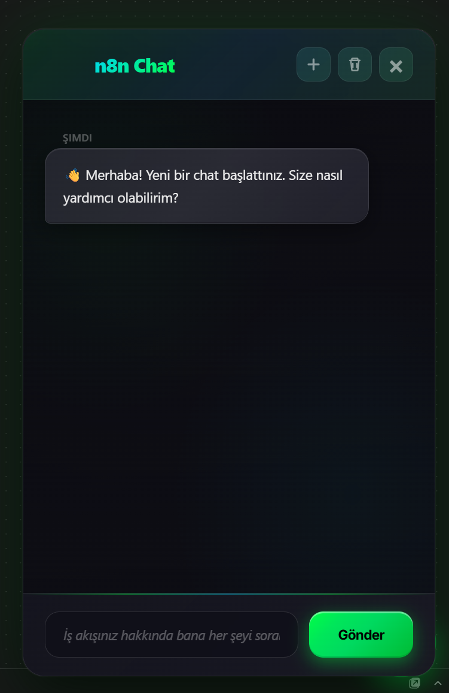
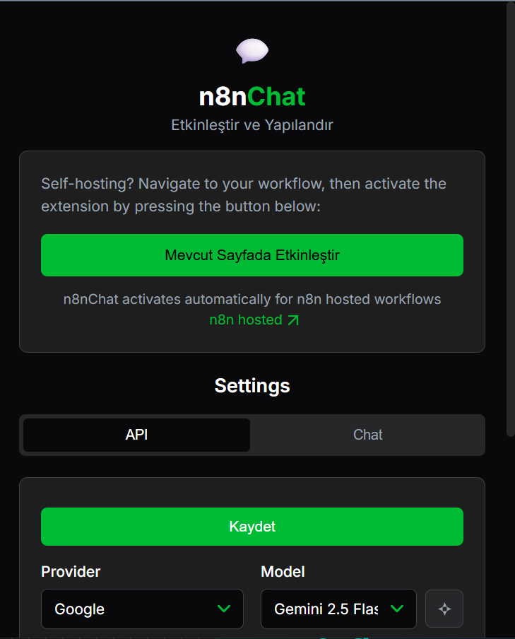

# n8n Agentic Chat

> **n8n** - Transform your workflow creation with AI-powered agentic assistance

[](https://opensource.org/licenses/MIT)
[](https://chrome.google.com/webstore)
[](https://github.com/eros1sh/n8n-workflow-agent)

An intelligent Chrome extension that brings **Cursor-style agentic workflow editing** to n8n. Create, modify, analyze, and debug workflows using natural language with multi-step autonomous execution.



---

## ✨ Features

### 🤖 **Agentic Multi-Step Execution**
- **Autonomous workflow creation**: AI automatically executes ALL required steps until completion
- **Multi-step planning**: AI breaks down complex requests into actionable steps
- **Continuous execution**: Never stops mid-task - completes the entire workflow automatically
- **Smart continuation**: Context-aware guidance after each function execution

### 🎨 **Modern Chat Interface**
- **Glassmorphism design** with animated gradients and smooth transitions
- **Real-time streaming** responses with typing effect
- **Function execution badges** with status icons and animations
- **Smart timestamps** with automatic message grouping
- **Drag-and-drop positioning** with persistent layout
- **Enhanced markdown** support (code blocks, links, formatting)

### 🧠 **Intelligent Workflow Management**
- **Create workflows** from natural language descriptions
- **Modify existing nodes** with context-aware updates
- **Analyze workflows** for architecture, performance, and security issues
- **Debug workflows** with integrated real-time logging
- **Auto-fix issues** detected during analysis
- **Smart node selection**: Prefers dedicated service nodes over generic HTTP requests

### 🤖 **LangChain & AI Agent Support** (NEW)
- **Create LangChain agents** with tools, memory, and configuration
- **Add tools to agents** (HTTP Request, Workflow, Code nodes)
- **Configure agent memory** (Window Buffer, Conversation Summary, Vector Store)
- **Multi-agent workflows** (Single Agent, Gatekeeper, Multi-Agent Teams)
- **Chained AI workflows** with multiple AI models in sequence

### 🔍 **Vector Store & RAG Support** (NEW)
- **Vector store connections** (Qdrant, Pinecone, Weaviate, Chroma)
- **Embedding nodes** for text-to-vector conversion
- **Vector search nodes** for semantic search
- **Complete RAG workflows** (Data Source → Embeddings → Vector Store → LLM)

### ⚙️ **Workflow Execution Control** (NEW)
- **Execute workflows** with input data and wait for completion
- **Stop running executions**
- **Get execution status** in real-time
- **Retry failed executions** from specific nodes

### 🔐 **Credential Management** (NEW)
- **Check node credentials** configuration
- **Suggest credential types** based on node type
- **Validate credential connections**
- **Get credential details** with usage examples (`={{$credentials.apiKey}}`)
- **Automatic credential assignment** when creating nodes
- **411 credential types** with full documentation

### 🔄 **Sub-workflow Management** (NEW)
- **Create Execute Workflow nodes** for sub-workflows
- **Import workflows as sub-workflows**
- **Get sub-workflow information**

### ⚡ **Advanced Node Configuration** (NEW)
- **Configure webhook settings** (path, method, authentication)
- **Configure schedule/cron** triggers
- **Configure error handling** (retry, continue on fail)

### 📦 **Batch Processing & Looping** (NEW)
- **Create batch processors** with Split in Batches
- **Create loop nodes** (for each, while, until)
- **Configure split in batches** settings

### 🎨 **Advanced UI Features** (NEW)
- **Workflow visualization** (Mermaid diagrams)
- **Group nodes** visually
- **Set custom node colors** for organization

### 🔗 **Advanced Connection Handling**
- **Automatic connection** of newly created nodes
- **Ghost connection cleanup** prevents workflow corruption
- **Vue reactivity sync** eliminates race conditions
- **Connection verification** ensures workflow integrity

### 🎯 **Multi-Provider AI Support**
- **OpenAI** (GPT-4, GPT-3.5, o1, o3)
- **Anthropic** (Claude 3.5 Sonnet, Opus, Haiku)
- **Google** (Gemini 2.5 Pro, Flash)
- **DeepSeek** (DeepSeek R1, DeepSeek Chat)
- **OpenRouter** (Meta Llama, Mistral, and more)
- **Groq** (Ultra-fast inference)
- **Cohere** (Command models)
- **Local LLM** (Ollama, LM Studio, etc.)

### 🔧 **Real-Time Debugging**
- **Integrated debug server** with WebSocket support
- **Function call logging** with full argument tracking
- **Error tracking** with stack traces and context
- **Session summaries** with operation metrics
- **Toggle on/off** directly from extension popup

### 🌍 **Language Consistency**
- **Automatic language detection**: Responds in the same language as user's input
- Supports Turkish, English, Spanish, and more
- Never switches languages mid-conversation

---

## 🚀 Installation

### Prerequisites
- Google Chrome or Chromium-based browser (Edge, Brave, etc.)
- n8n instance (cloud or self-hosted)
- API key from one of the supported AI providers (optional for local LLM)

### Install from Chrome Web Store
1. Visit the [Chrome Web Store](https://chrome.google.com/webstore) *(coming soon)*
2. Click "Add to Chrome"
3. Pin the extension to your toolbar

### Install from Source
1. **Clone the repository:**
   ```bash
   git clone https://github.com/eros1sh/n8n-workflow-agent.git
   cd n8n-workflow-agent
   ```

2. **Load the extension in Chrome:**
   - Open Chrome and navigate to `chrome://extensions/`
   - Enable "Developer mode" (top right)
   - Click "Load unpacked"
   - Select the `extension` folder

3. **Configure your API keys:**
   - Click the extension icon in your toolbar
   - Go to Settings → API tab
   - Select your preferred AI provider
   - Enter your API key
   - Click "Save"

---

## 📖 Usage

### Getting Started

1. **Navigate to n8n:**
   - Open your n8n workflow editor (e.g., `https://app.n8n.cloud/workflow/...`)

2. **Activate the extension:**
   - Click the extension icon
   - Click "Activate on Current Page"
   - A floating chat button will appear in the bottom right

3. **Start chatting:**
   - Click the floating chat button (💬)
   - Type your request in natural language
   - Press Enter or click "Send"

### Example Prompts

#### **Create Workflows**
```
Create a workflow that:
- Gets data from Supabase
- Summarizes content with AI
- Sends result to Telegram
```

#### **Modify Workflows**
```
Replace all Google Sheets nodes with Supabase nodes
```

#### **Analyze Workflows**
```
Analyze this workflow for performance and security issues
```

#### **Debug Workflows**
```
Why isn't my webhook trigger working?
```

#### **Get Information**
```
Show me the workflow structure and connections
```

#### **Create AI Agent Workflows**
```
Create an AI agent that can search the web and send results to Telegram
```

#### **Create RAG Workflows**
```
Create a RAG workflow that answers questions from company PDFs using Qdrant
```

#### **Configure Workflows**
```
Configure the webhook node to accept POST requests at /webhook/my-endpoint
```

---

## 🎯 Key Concepts

### Agentic Execution Model

The extension operates in **agentic mode**, meaning it **autonomously executes multiple steps** to complete complex tasks:

1. **User Request**: "Replace Google Sheets with Supabase"
2. **AI Planning**: Breaks down into steps:
   - Get workflow info
   - Remove Google Sheets nodes
   - Create Supabase nodes
   - Connect new nodes
   - Clean layout
   - Validate workflow
3. **Autonomous Execution**: AI executes ALL steps sequentially without stopping
4. **Verification**: AI confirms completion and reports results

**No manual intervention required** - the AI handles the entire workflow lifecycle.

### Smart Node Selection

The AI **automatically prefers dedicated service nodes** over generic HTTP requests:

| User Intent | Selected Node Type |
|-------------|-------------------|
| "Use OpenAI" | `@n8n/n8n-nodes-langchain.openAi` |
| "Connect to Supabase" | `n8n-nodes-base.supabase` |
| "Send to Telegram" | `n8n-nodes-base.telegram` |
| "Google Sheets" | `n8n-nodes-base.googleSheets` |
| "PostgreSQL database" | `n8n-nodes-base.postgres` |

**HTTP Request node** is used ONLY when no dedicated node exists.

### Connection Management

Every created node is **automatically connected** to the workflow:

```
Trigger → Processing → AI/Logic → Storage/Output
```

**Rules enforced:**
- No floating/orphan nodes
- Logical flow maintained
- All connections verified
- Ghost connections cleaned up

---

## 🛠️ Configuration

### AI Provider Settings

Navigate to **Settings → API** in the extension popup:

| Provider | Required | Get API Key |
|----------|----------|-------------|
| **OpenAI** | API Key | [platform.openai.com](https://platform.openai.com/api-keys) |
| **Anthropic** | API Key | [console.anthropic.com](https://console.anthropic.com/settings/keys) |
| **Google Gemini** | API Key | [aistudio.google.com](https://aistudio.google.com/app/apikey) |
| **DeepSeek** | API Key | [platform.deepseek.com](https://platform.deepseek.com/) |
| **OpenRouter** | API Key | [openrouter.ai](https://openrouter.ai/keys) |
| **Groq** | API Key | [console.groq.com](https://console.groq.com/keys) |
| **Cohere** | API Key | [dashboard.cohere.com](https://dashboard.cohere.com/api-keys) |
| **Local LLM** | API URL | Configure your local server (e.g., `http://localhost:1234/v1`) |

### Chat Settings

Navigate to **Settings → Chat**:

- **Include Workflow Context**: Send current workflow data with each request
- **Node Creation**: Allow AI to create new nodes
- **Node Editing**: Allow AI to modify node parameters
- **Node Removal**: Allow AI to delete nodes
- **Workflow Access**: Allow AI to read workflow information
- **Node Library Access**: Allow AI to browse available node types

### Advanced Settings

- **Temperature** (0.0 - 1.0): Controls response creativity (lower = deterministic, higher = creative)
- **Max Tokens**: Maximum tokens for AI response (higher = longer responses, more expensive)
- **Top P** (0.0 - 1.0): Controls response diversity
- **Reasoning Level**: For reasoning models (o1, o3) - low/medium/high

---

## 🐛 Debugging

### Enable Debug Mode

1. Open extension popup
2. Navigate to "Debug" tab
3. Toggle "Enable Debug API"
4. Chat will now log all function calls and responses

### Debug Server (Optional)

For advanced debugging with WebSocket support:

```bash
cd debug-server
npm install
node server.js
```

The debug server runs on `http://localhost:3456` and provides:
- Real-time function call logging
- Error tracking with stack traces
- Session summaries
- WebSocket streaming

---

## 🏗️ Architecture

```
┌─────────────────────────────────────────────────┐
│              Chrome Extension                    │
├─────────────────────────────────────────────────┤
│  content.js  │  Modern Chat UI & Stream Handler │
│  injected.js │  n8n Canvas Manipulation          │
│  popup.js    │  Settings & Configuration         │
│  background/ │  API Handlers (Multi-Provider)    │
└─────────────────────────────────────────────────┘
                    ↕ (Function Calls)
┌─────────────────────────────────────────────────┐
│              n8n Workflow Editor                 │
├─────────────────────────────────────────────────┤
│  Vue.js App  │  Pinia Store  │  Canvas Operations│
└─────────────────────────────────────────────────┘
```

### Key Components

- **`content.js`**: Chat UI, message streaming, conversation history
- **`injected.js`**: Direct n8n canvas manipulation, node CRUD, connection management
- **`popup.js`**: Extension settings, API configuration, debug controls
- **`background/api-handlers.js`**: Multi-provider AI streaming handlers
- **`lib/storage.js`**: Secure Chrome storage for settings and API keys

---

## 🔒 Security & Privacy

### Data Handling
- **API keys** are stored securely in Chrome's encrypted storage
- **No telemetry** or usage tracking
- **No server-side processing** - all AI requests go directly to your chosen provider
- **Local-first**: Chat history stored locally in your browser

### Permissions Explained
- **`storage`**: Save settings and API keys locally
- **`scripting`**: Inject content scripts into n8n pages
- **`tabs`**: Detect n8n workflow pages
- **`activeTab`**: Access current tab for activation
- **`host_permissions`**: Connect to AI provider APIs and local debug server

### What is Sent to AI Providers?
- Your workflow structure (nodes, connections, parameters) - **only when "Include Workflow Context" is enabled**
- Your chat messages
- Function call results

**What is NOT sent:**
- Credentials or API keys stored in your workflows
- Sensitive data (masked automatically)
- Your IP address or personal information (beyond what the AI provider collects)

---

## 🤝 Contributing

Contributions are welcome! Please read [CONTRIBUTING.md](CONTRIBUTING.md) for details on our code of conduct and the process for submitting pull requests.

### Development Setup

1. **Clone the repo:**
   ```bash
   git clone https://github.com/eros1sh/n8n-workflow-agent.git
   cd n8n-workflow-agent
   ```

2. **Install debug server dependencies (optional):**
   ```bash
   cd debug-server
   npm install
   ```

3. **Load extension in Chrome:**
   - Enable Developer mode in `chrome://extensions/`
   - Click "Load unpacked" and select the `extension` folder

4. **Make your changes**

5. **Test thoroughly** on n8n workflows

6. **Submit a pull request**

---

## 📦 Supported Nodes & Credentials

### Node Support

**Total: 1000+ Nodes**

#### Official Nodes (788 nodes)
- **IO / Triggers / API & Data**: 300+ nodes
  - Webhooks, HTTP Request, Schedule Trigger, Telegram Trigger, etc.
  - Database nodes: PostgreSQL, MySQL, MongoDB, Redis, Supabase, etc.
  - API integrations: Airtable, Asana, Slack, Discord, GitHub, etc.
  
- **Logic / Conditional**: 50+ nodes
  - If, Switch, Merge, Wait, etc.
  
- **Flow Control**: 30+ nodes
  - Split, Merge, Loop, etc.
  
- **Data Transform**: 100+ nodes
  - Set, Edit Fields, Transform, etc.
  
- **Code / Script**: 20+ nodes
  - Code, Function, etc.
  
- **AI / LLM**: 50+ nodes
  - OpenAI, Anthropic, Gemini, LangChain agents, etc.
  
- **Communication**: 100+ nodes
  - Telegram, Slack, Discord, Email, SMS, etc.
  
- **File / Storage**: 80+ nodes
  - AWS S3, Google Drive, Dropbox, etc.
  
- **Commerce / Payment**: 50+ nodes
  - Stripe, PayPal, Razorpay, etc.

#### Community Nodes (212 nodes)
- Community-developed integrations
- Custom service connectors
- Specialized workflow tools

### Credential Support

**Total: 411 Credential Types**

- **API Credentials**: 200+ types
  - API keys, OAuth2, Basic Auth, etc.
  
- **Database Credentials**: 30+ types
  - PostgreSQL, MySQL, MongoDB, Redis, etc.
  
- **Cloud Service Credentials**: 100+ types
  - AWS, Google Cloud, Azure, etc.
  
- **Communication Credentials**: 50+ types
  - Telegram, Slack, Discord, Email, etc.
  
- **Payment Credentials**: 30+ types
  - Stripe, PayPal, Razorpay, etc.

**Her credential için:**
- ✅ Field definitions (apiKey, accessToken, etc.)
- ✅ Usage examples (`={{$credentials.apiKey}}` formatında)
- ✅ Authentication configuration
- ✅ Test configuration

### Smart Node Selection

AI automatically selects the best node based on your intent:

| User Intent | Selected Node | Credential |
|-------------|---------------|------------|
| "Send Telegram message" | `n8n-nodes-base.telegram` | `telegramApi` |
| "Connect to PostgreSQL" | `n8n-nodes-base.postgres` | `postgres` |
| "Use OpenAI" | `@n8n/n8n-nodes-langchain.openAi` | `openAiApi` |
| "Google Sheets" | `n8n-nodes-base.googleSheets` | `googleSheetsOAuth2` |
| "Supabase database" | `n8n-nodes-base.supabase` | `supabaseApi` |

**New in v1.6.0:** AI can now find nodes from natural language using semantic search:
- "telegram mesajı gönder" → Automatically finds `n8n-nodes-base.telegram`
- "postgres'e bağlan" → Automatically finds `n8n-nodes-base.postgres`
- Supports 1000+ nodes (788 official + 212 community)

---

## 🆕 What's New

### v1.6.0 (Latest Release - 2026-01-22)

**Comprehensive Node & Credential Intelligence:**
- ✅ **Semantic node selection** from user intent (`find_node_by_intent()`)
- ✅ **Complete credential database** (411 credential types)
- ✅ **Credential usage examples** (`={{$credentials.apiKey}}` formatında)
- ✅ **1000+ node support** (788 official + 212 community nodes)
- ✅ **Automatic credential assignment** when creating nodes
- ✅ **Enhanced node discovery** functions
- ✅ **Credential details** with authentication configuration

**New Functions:**
- `find_node_by_intent()` - Find nodes from natural language
- `get_node_credentials()` - Get credential requirements for a node
- `get_credential_details()` - Get full credential information
- `get_credential_usage_examples()` - Get credential usage examples

### v1.5.0

**Comprehensive Node & Credential Intelligence:**
- ✅ Semantic node selection from user intent
- ✅ Complete credential database (411 types)
- ✅ Credential usage examples (`={{$credentials.apiKey}}`)
- ✅ 1000+ node support (788 official + 212 community)
- ✅ Automatic credential assignment
- ✅ Enhanced node discovery functions

### v1.5.0

**Phase 4 Features:**

**LangChain & AI Agent Support:**
- ✅ Create LangChain agent nodes with tools and memory
- ✅ Connect tools to agents automatically
- ✅ Configure agent memory (Window Buffer, Conversation Summary, Vector Store)
- ✅ Support for all n8n AI agentic workflow patterns

**Vector Store & RAG:**
- ✅ Vector store connections (Qdrant, Pinecone, Weaviate, Chroma)
- ✅ Embedding node creation
- ✅ Vector search nodes
- ✅ Complete RAG workflow generation

**Workflow Execution:**
- ✅ Execute workflows programmatically
- ✅ Stop and monitor executions
- ✅ Retry failed executions

**Credential Management:**
- ✅ Check node credentials
- ✅ Suggest credential types
- ✅ Validate credential connections

**Advanced Features:**
- ✅ Sub-workflow management
- ✅ Advanced node configuration (webhooks, schedules, error handling)
- ✅ Batch processing and looping
- ✅ Workflow visualization (Mermaid diagrams)
- ✅ Node grouping and custom colors

## 🐛 Known Issues & Limitations

- **Vue Store Access**: The extension relies on n8n's internal Vue/Pinia store structure. Future n8n updates may break compatibility temporarily.
- **Race Conditions**: Fixed with `waitForVueUpdate()`, but edge cases may exist.
- **Token Limits**: Large workflows may exceed model context windows. Use "Lazy Loading" context strategy or disable "Node Library Access".
- **Language Switching**: AI may occasionally switch languages mid-conversation (rare, fixed in v1.4.2).
- **Vector Store Credentials**: Vector store connections require manual credential configuration in n8n settings (security best practice).

See [Issues](https://github.com/eros1sh/n8n-workflow-agent/issues) for full list.

---

## 📜 License

This project is licensed under the MIT License - see the [LICENSE](LICENSE) file for details.

---

## 🙏 Acknowledgments

- **n8n** for building an amazing workflow automation platform
- **OpenAI, Anthropic, Google** for providing powerful AI models
- **Cursor** for inspiring the agentic execution model
- **The n8n Community** for feedback and feature requests

---

## 📞 Support

- **Email**: root@eros.sh
- **Telegram**: @eros_sh
- **Issues**: [GitHub Issues](https://github.com/eros1sh/n8n-workflow-agent/issues)

---

## ⭐ Star History

If you find this project useful, please consider giving it a star! ⭐

---

## 📸 Screenshots

### Chat Interface


### Settings


---

<div align="center">
  <strong>Made with ❤️ for the n8n community</strong>
</div>
